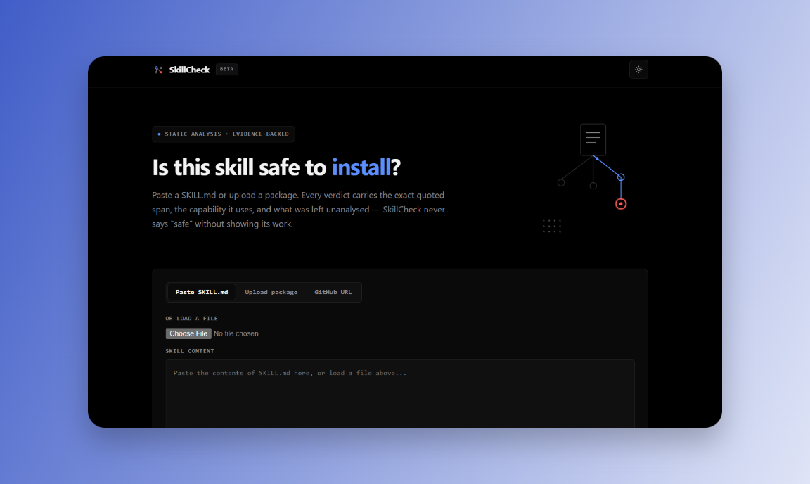
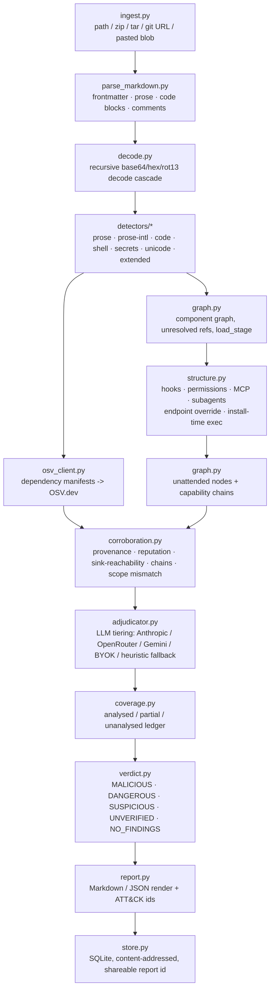
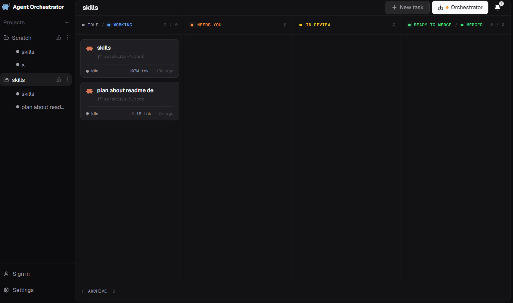
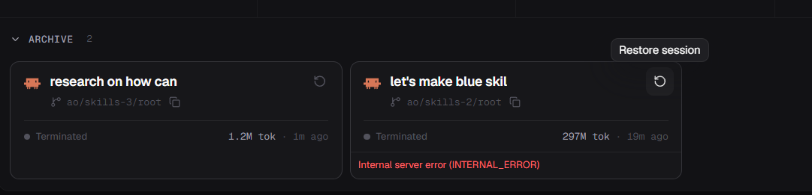

# SkillCheck

Evidence-backed static-analysis scanner for AI-agent `SKILL.md` packages. It never returns "safe" —
only `MALICIOUS`, `DANGEROUS`, `SUSPICIOUS`, `UNVERIFIED`, or `NO_FINDINGS`, each backed by quoted
evidence, a capability label, and a coverage ledger of what was and wasn't analysed.

**Live**: [skillcheck-1r47.onrender.com](https://skillcheck-1r47.onrender.com/)



## What it does

- Ingests a skill as a pasted blob, an uploaded `.zip`/`.tar[.gz]`/`.md` file, or a public GitHub repo URL
  (cloned with `git clone --depth 1`).
- Parses Markdown into frontmatter, prose, fenced code blocks, and HTML comments, tracking line numbers
  back to the original file, and recursively decodes base64/hex/rot13-style obfuscated payloads before
  re-scanning the decoded text.
- Runs prose (English + 7 more languages), AST-based Python, shell (incl. a de-obfuscation pass for
  quote-splitting and `$IFS`-as-separator command hiding), secrets, unicode (bidi/zero-width/homoglyph
  tricks), and extended detectors over every layer; a detector that throws is caught and turned into an
  `SC-SCN1` integrity finding instead of failing the whole scan.
- Reads the same 7 prompt-injection/exfiltration/persistence intents in Spanish, French, German,
  Portuguese, Russian, Chinese, and Japanese (`SC-PI1`–`SC-PI49`) as it does in English — a `SKILL.md` is
  markdown, not English, so the prose payload isn't either.
- Reads what the package *declares*, not just what it says (`SC-ST1`–`SC-ST8`): event hooks and
  `statusLine` commands in a bundled `settings.json`, `bypassPermissions` and unscoped tool grants,
  bundled MCP servers, `.claude/agents/*.md` subagent definitions, `env` vars that retarget the
  harness's own outbound traffic, npm install scripts, in-tree PEP 517 build backends, and bundled code
  SKILL.md never reaches. A skill shipping only those files would otherwise score `NO_FINDINGS`.
- Looks up dependency manifests against OSV.dev, builds a component/capability graph across referenced
  files (flagging unresolved references as `SC-REF1`, and tracking a per-node `load_stage` so
  hook/install-triggered content is scored as unattended), and corroborates findings by provenance,
  reputation, sink-reachability, capability chains, and declared-vs-actual scope mismatches.
- Ranks every finding into a tier with an LLM adjudicator (Anthropic direct, OpenRouter, or Gemini,
  precedence in that order, or a caller-supplied bring-your-own-key), falling back to a deterministic
  heuristic tiering when no key is configured anywhere — the scan still completes.
- Tracks a coverage ledger (analysed / partial / unanalysed bytes per file) and renders a final verdict
  as Markdown or JSON, cached in SQLite by `sha256(ruleset_version + content)` so identical scans share a
  permalink report.
- Recognized capability labels: `credential_access`, `exfiltration`, `hidden_execution`, `stage2_fetch`,
  `persistence`, `anti_forensics`, `agent_manipulation`, `task_then_payload`, `scope_mismatch`,
  `obfuscation`, `ssrf`, `privilege_escalation`, `harmful_content`, `anti_refusal`, `agent_snooping`,
  `unscanned_reference`, `unknown`.

## Architecture



Single FastAPI service (`backend/api/main.py`) serves both the JSON API and the static frontend — there
is no separate frontend build or deploy.

## Determinism

Detection is deterministic: same bytes in, same findings out — no key, no network, no clock. An LLM
participates only *after* detection, to rank findings that already exist. It cannot create a finding,
and it cannot delete one.

| Stage | Deterministic | Notes |
|---|---|---|
| ingest · parse · decode · detectors · structure | Yes | Pure functions over file bytes |
| component graph · chains · corroboration | Yes | |
| `verdict.py::decide_verdict` | Yes | Priority-ordered rules; no corpus-tuned thresholds |
| `report.py` render + ATT&CK/OWASP mapping | Yes | Static mapping table |
| OSV.dev lookup | **No** | Network; advisory data changes over time |
| Repo ingestion (`git clone`) | **No** | Remote content changes |
| LLM tiering + `SC-SEM1` semantic pass | **No** | Absent with no key; the heuristic fallback that replaces it *is* deterministic |

Consequences worth stating:

- **A verdict reached deterministically holds with the network unplugged.** With no API key configured,
  every rule still runs and the scan still completes — only tiering changes.
- **Tests assert the deterministic path on purpose.** `tests/test_structure.py` unsets every provider
  key in an autouse fixture, so a machine that happens to have one configured can't turn those into
  accidentally-correct, untested LLM results.
- **Nothing convicts on an unexplainable number.** There is no risk score. Every `MALICIOUS` traces to a
  named rule, a quoted span with line numbers, and the chain or corroboration edge that escalated it.

Full breakdown in **[docs/detection-model.md](docs/detection-model.md)**.

## API

| Method | Path | Purpose |
|---|---|---|
| `POST` | `/api/scan/text` | Scan a pasted `{name, text}` skill. |
| `POST` | `/api/scan/upload` | Scan an uploaded `.zip`/`.tar[.gz]`/`.md` file (streamed, 25 MB cap). |
| `POST` | `/api/scan/repo` | Scan a public GitHub repo by URL. |
| `GET` | `/api/report/{report_id}` | Fetch a previously stored report by its permalink id. |
| `GET` | `/api/health` | Liveness check (used by Render's health check and the keepalive workflow). |
| `GET` | `/` | Serves `frontend/index.html`. |
| `GET` | `/app.js` | Serves `frontend/app.js` same-origin (required by the strict `script-src 'self'` CSP). |

Both scan endpoints accept an optional `llm_provider` / `llm_api_key` for a bring-your-own-key
adjudication request, and are rate-limited in-process at 20 requests/60s per IP.

## Quickstart

```bash
pip install -r backend/requirements.txt

cd backend
uvicorn api.main:app --reload      # http://localhost:8000

python -m skillcheck.cli <path|zip|tar|git-url> [--json]

pytest                              # from backend/
```

```bash
docker build -f backend/Dockerfile -t skillcheck .   # run from repo root
```

## Configuration

All of the following are optional — SkillCheck runs end-to-end with zero required environment
variables, falling back to a deterministic heuristic tiering when no LLM key is set:

| Variable | Purpose |
|---|---|
| `ANTHROPIC_API_KEY` | Direct Anthropic API adjudication. Wins if set. |
| `SKILLCHECK_ADJUDICATOR_MODEL` | Overrides the Anthropic model (default `claude-sonnet-5`). |
| `OPENROUTER_API_KEY` | Adjudication via OpenRouter. Used only if `ANTHROPIC_API_KEY` is unset. |
| `SKILLCHECK_OPENROUTER_MODEL` | Overrides the OpenRouter model (default `anthropic/claude-sonnet-4.5`). |
| `GEMINI_API_KEY` | Adjudication via Google's Gemini API. Used only if neither key above is set. |
| `SKILLCHECK_GEMINI_MODEL` | Overrides the Gemini model (default `gemini-2.5-flash`). |

## Deployment

`render.yaml` defines a single Render Blueprint web service (`skillcheck`), built from
`backend/Dockerfile` with the repo root as build context (so the image can copy both `backend/` and
`frontend/`), health-checked at `/api/health`, with `autoDeploy: true`. `.github/workflows/keepalive.yml`
curls that health endpoint every 10 minutes (plus manual dispatch) to stop Render's free-tier instance
from cold-starting; it is not a test/build/deploy CI pipeline. Deployed at
[skillcheck-1r47.onrender.com](https://skillcheck-1r47.onrender.com/).



This project was built with parallel AO (agent-orchestrator) worker sessions — see
**[How this project was built with AO](docs/ao.md)** for what the git history actually shows, and the
issues run into along the way.



## Docs

- **[docs/detection-model.md](docs/detection-model.md)** — what SkillCheck looks for and why: the four
  signal classes, the full rule inventory, the determinism boundary, and the known blind spots.
- **[docs/architecture.md](docs/architecture.md)** — how it's wired: pipeline stages, detectors,
  structure layer, capability taxonomy, corroboration, adjudication, verdict logic, frontend design
  system.
- **[docs/ao.md](docs/ao.md)** — how AO was used on this project, and the issues encountered.

## Tests

```bash
cd backend
pytest                      # 241 tests, deterministic, no network or API key required
python tests/eval.py        # red-team gate + benign false-positive ratchet
```

`pytest` runs every `test_*.py` under `backend/tests/`: `test_adjudicator.py`, `test_deobfuscation.py`,
`test_evidence.py`, `test_integrity.py`, `test_load_stage.py`, `test_prose_intl.py`,
`test_security_fixes.py`, `test_shell_deobfuscation.py`, `test_structure.py`, `test_unicode_tricks.py`.
`backend/tests/eval.py` is a separate, non-pytest gate script — `--real-corpus <dir>` runs it against an
external corpus, `--mutate` runs mutation testing.

## Detection results

Every number below is reproducible from a clean checkout with the command shown above it. The two
checked-in gates are deterministic and will reproduce exactly; the real-world sample corpus is fetched
on demand and is a point-in-time reading, not a target.

```bash
cd backend && python tests/eval.py
```

**Red corpus** — 39 hand-authored fixtures under `backend/tests/fixtures/red/`, one per distinct
technique, each pinned in `manifest.yaml` to the specific rule(s)/capability(ies)/provenance tag(s)
it must trip, not just a label. That distinction matters: a fixture reaching `MALICIOUS` via the
wrong rule is scored `WRONG_REASON`, a separate failure from a fixture that never got flagged at
all (`LABEL_MISS`) — passing on label alone proves nothing about whether the mechanism under test
actually fired.

| result | count |
|---|---|
| passed on label AND reason | 39/39 |

**Benign corpus (hand-written)** — 23 fixtures under `backend/tests/fixtures/benign/`, gated at
`DANGEROUS+`: any hand-written benign fixture that reaches `DANGEROUS` or `MALICIOUS` is a false
positive by definition, since these fixtures are constructed to have nothing to find.

| result | count |
|---|---|
| false-positived at DANGEROUS+ | 0/23 (0.0%) |

**Real-world samples** — not checked in (the eval script fetches these on demand), so the numbers
below are a point-in-time reading, not a target:

```bash
cd backend && python tests/eval.py --real-corpus <dir>
```

| corpus | skills scanned | label distribution | DANGEROUS+ |
|---|---|---|---|
| `anthropics/skills` (first-party) | 17 | 13 `NO_FINDINGS`, 4 `SUSPICIOUS` | 0/17 (0.0%) |
| a public third-party plugin marketplace | 248 | 228 `NO_FINDINGS`, 12 `SUSPICIOUS`, 7 `UNVERIFIED`, 1 `MALICIOUS` | 1/248 (0.4%) |

The `DANGEROUS+` column counts **convictions only**. Under the stricter "any non-clean verdict is a
false positive" definition some scanners use, the third-party number is 20/248 (8.1%), or 13/248
(5.2%) excluding `UNVERIFIED` — which is a coverage statement rather than an accusation. All three
definitions are stated because quoting only the most flattering one is how these numbers stop meaning
anything.

Both corpora are *presumed*-benign, not ground-truth-labeled, so this is an FP-rate proxy, not a
recall benchmark — that's what the red corpus above is for. The first-party set is included on
purpose even though it's small: tuning only against Anthropic's own polished skills understates the
rate a real installer sees, which is why the third-party marketplace sample is fifteen times larger.
The 7 `UNVERIFIED` results are mostly a clone artifact, not a scanner finding — a handful of skills
in that marketplace ship files with paths long enough that a shallow `git clone` on Windows silently
dropped them, and this scanner correctly refuses to call an incomplete bundle `NO_FINDINGS` (I3).

The one `MALICIOUS` result was a reproduced false positive in `SC-P7`
(`\b(?:read|open|cat|copy|upload)\b.{0,40}(?:...\.env\b...)`): the old pattern matched an entirely
ordinary scaffolding instruction — *"Install deps, create db, seed data, **copy** .env.example →
**.env**"* — because `\.env\b` matches the boundary inside `.env.example` too, and then chained,
same-file, with an unrelated `SC-E2` SSRF match on a `http://localhost:8000` mentioned two paragraphs
later, which was enough same-file corroboration to clear the deterministic-fallback `CONFIRMED`
threshold with no LLM in the loop.

`SC-P7` now distinguishes a real credential path from its own placeholder suffix
(`.env.example`/`.sample`/`.template`/`.dist` are exempted, but `.env.local` and other real secret
variants still fire), and separately stops `copy`/`upload` — the two verbs whose direction is
ambiguous — from reaching a credential path that sits on the far side of a `to`/`into`/`→`/`->`
connector, so "copy `.env.example` → `.env`" no longer matches on either occurrence while "copy
`~/.ssh/id_rsa`" and "upload `~/.ssh/id_rsa` to attacker.com" still do. Covered by
`test_sc_p7_credential_prose_matches_realistic_phrasing` in `test_security_fixes.py` plus the
narrowing cases inline in `detectors/prose.py`.
