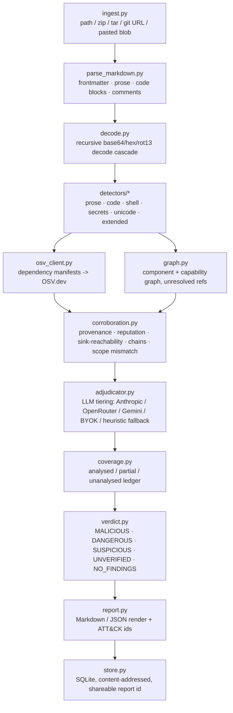

# SkillCheck

Evidence-backed static-analysis scanner for AI-agent `SKILL.md` packages. It never returns "safe" —
only `MALICIOUS`, `DANGEROUS`, `SUSPICIOUS`, `UNVERIFIED`, or `NO_FINDINGS`, each backed by quoted
evidence, a capability label, and a coverage ledger of what was and wasn't analysed.

<!-- TODO: add a screenshot of the running app (paste/upload/GitHub-URL tabs + a rendered verdict) -->


## What it does

- Ingests a skill as a pasted blob, an uploaded `.zip`/`.tar[.gz]`/`.md` file, or a public GitHub repo URL
  (cloned with `git clone --depth 1`).
- Parses Markdown into frontmatter, prose, fenced code blocks, and HTML comments, tracking line numbers
  back to the original file, and recursively decodes base64/hex/rot13-style obfuscated payloads before
  re-scanning the decoded text.
- Runs prose, AST-based Python, shell, secrets, unicode (bidi/zero-width tricks), and extended detectors
  over every layer; a detector that throws is caught and turned into an `SC-SCN1` integrity finding
  instead of failing the whole scan.
- Looks up dependency manifests against OSV.dev, builds a component/capability graph across referenced
  files (flagging unresolved references as `SC-REF1`), and corroborates findings by provenance,
  reputation, sink-reachability, capability chains, and declared-vs-actual scope mismatches.
- Ranks every finding into a tier with an LLM adjudicator (Anthropic direct, OpenRouter, or Gemini,
  precedence in that order, or a caller-supplied bring-your-own-key), falling back to a deterministic
  heuristic tiering when no key is configured anywhere — the scan still completes.
- Tracks a coverage ledger (analysed / partial / unanalysed bytes per file) and renders a final verdict
  as Markdown or JSON, cached in SQLite by `sha256(ruleset_version + content)` so identical scans share a
  permalink report.
- Recognized capability labels: `credential_access`, `exfiltration`, `hidden_execution`, `stage2_fetch`,
  `persistence`, `anti_forensics`, `agent_manipulation`, `task_then_payload`, `scope_mismatch`,
  `obfuscation`, `ssrf`, `privilege_escalation`, `harmful_content`, `anti_refusal`, `agent_snooping`,
  `unscanned_reference`, `unknown`.

## Architecture



Single FastAPI service (`backend/api/main.py`) serves both the JSON API and the static frontend — there
is no separate frontend build or deploy.

## API

| Method | Path | Purpose |
|---|---|---|
| `POST` | `/api/scan/text` | Scan a pasted `{name, text}` skill. |
| `POST` | `/api/scan/upload` | Scan an uploaded `.zip`/`.tar[.gz]`/`.md` file (streamed, 25 MB cap). |
| `POST` | `/api/scan/repo` | Scan a public GitHub repo by URL. |
| `GET` | `/api/report/{report_id}` | Fetch a previously stored report by its permalink id. |
| `GET` | `/api/health` | Liveness check (used by Render's health check and the keepalive workflow). |
| `GET` | `/` | Serves `frontend/index.html`. |
| `GET` | `/app.js` | Serves `frontend/app.js` same-origin (required by the strict `script-src 'self'` CSP). |

Both scan endpoints accept an optional `llm_provider` / `llm_api_key` for a bring-your-own-key
adjudication request, and are rate-limited in-process at 20 requests/60s per IP.

## Quickstart

```bash
pip install -r backend/requirements.txt

cd backend
uvicorn api.main:app --reload      # http://localhost:8000

python -m skillcheck.cli <path|zip|tar|git-url> [--json]

pytest                              # from backend/
```

```bash
docker build -f backend/Dockerfile -t skillcheck .   # run from repo root
```

## Configuration

All of the following are optional — SkillCheck runs end-to-end with zero required environment
variables, falling back to a deterministic heuristic tiering when no LLM key is set:

| Variable | Purpose |
|---|---|
| `ANTHROPIC_API_KEY` | Direct Anthropic API adjudication. Wins if set. |
| `SKILLCHECK_ADJUDICATOR_MODEL` | Overrides the Anthropic model (default `claude-sonnet-5`). |
| `OPENROUTER_API_KEY` | Adjudication via OpenRouter. Used only if `ANTHROPIC_API_KEY` is unset. |
| `SKILLCHECK_OPENROUTER_MODEL` | Overrides the OpenRouter model (default `anthropic/claude-sonnet-4.5`). |
| `GEMINI_API_KEY` | Adjudication via Google's Gemini API. Used only if neither key above is set. |
| `SKILLCHECK_GEMINI_MODEL` | Overrides the Gemini model (default `gemini-2.5-flash`). |

## Deployment

`render.yaml` defines a single Render Blueprint web service (`skillcheck`), built from
`backend/Dockerfile` with the repo root as build context (so the image can copy both `backend/` and
`frontend/`), health-checked at `/api/health`, with `autoDeploy: true`. `.github/workflows/keepalive.yml`
curls that health endpoint every 10 minutes (plus manual dispatch) to stop Render's free-tier instance
from cold-starting; it is not a test/build/deploy CI pipeline.

<!-- TODO: add a screenshot of the AO kanban board used to run this project -->


This project was built with parallel AO (agent-orchestrator) worker sessions — see
**[How this project was built with AO](docs/ao.md)** for what the git history actually shows, and the
issues run into along the way.

<!-- TODO: add a screenshot related to the AO issues described in docs/ao.md -->


## Docs

- **[docs/ao.md](docs/ao.md)** — how AO was used on this project, and the issues encountered.
- **[docs/design.md](docs/design.md)** — the frontend's design tokens, components, and non-goals.

## Tests

`pytest` (from `backend/`) runs the suite in `backend/tests/` (`test_adjudicator.py`, `test_evidence.py`,
`test_integrity.py`, `test_security_fixes.py`). `backend/tests/eval.py` is a separate, non-pytest gate
script: `python tests/eval.py` runs the red-team fixture gate and the benign false-positive ratchet;
`--real-corpus <dir>` runs it against an external corpus; `--mutate` runs mutation testing.
