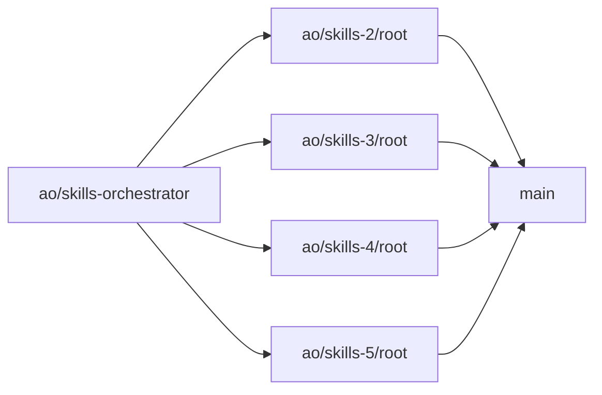

← [README](../README.md)

# How this project was built with AO

This describes what the local git history of this repo actually shows about its AO
(agent-orchestrator) usage — not a general description of AO.

## What the git history shows

- The repo was bootstrapped by AO itself: commit `563119a "initial commit"` is authored by
  `Agent Orchestrator <ao@example.com>`. Every feature commit after that (`e154fc6` onward) is authored
  by the human maintainer — AO set up the repo, the human drove the actual implementation work.
- Development ran across multiple parallel AO **worker sessions**, one per branch:
  `ao/skills-2/root`, `ao/skills-3/root`, `ao/skills-4/root`, `ao/skills-5/root`.
- A separate branch, `ao/skills-orchestrator`, coordinated those worker sessions rather than carrying
  feature commits of its own.
- Commit `974e1e5 "ao preserved skills-2"` is a real, orchestrator-authored checkpoint of a worker
  session's state — direct evidence that AO snapshots worker-session state as part of its normal
  operation (relevant to the session-loss issue below).

In short: AO was used as the session/worker orchestration and task-routing layer — spinning up isolated
worker sessions per branch and an orchestrator session to coordinate them — while the human authored and
reviewed every actual feature commit.

## Issues encountered

### Session loss after an update, with no warning

After an AO update, a worker session was lost outright. There was no warning beforehand that an update
could cost a session, and afterward the orchestrator had no record or context that the session had ever
existed — it could not be recovered or referenced from the orchestrator side.

### `cmd` loop

A recurring issue where AO would get stuck in a loop involving a `cmd`/shell invocation.

### Installer flagged as unsafe

Downloading/installing AO triggered an "unsafe" warning (OS/browser-level security flag) during the
download step.
