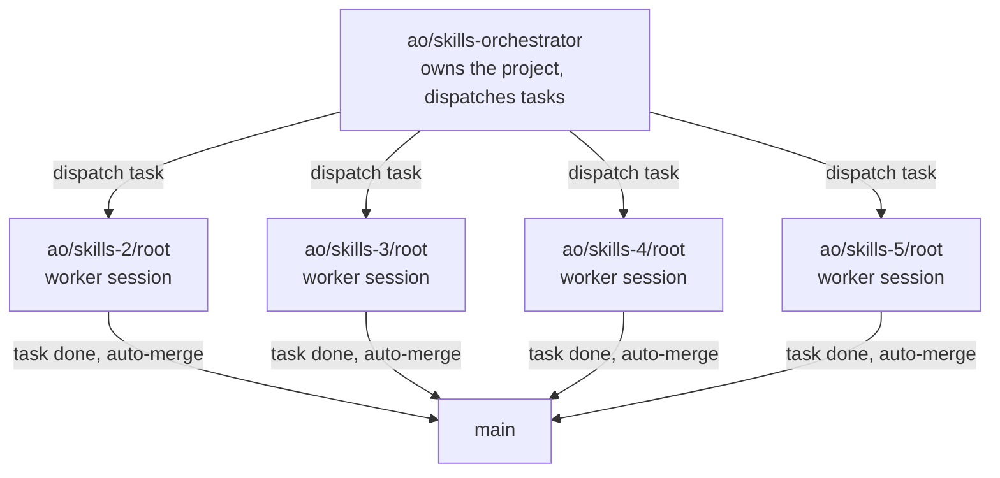

← [README](../README.md)

# How this project was built with AO

SkillCheck was built using AO (agent-orchestrator) as the task-distribution layer: an orchestrator
session owned the project and broke the work into discrete tasks — add an endpoint, harden a detector,
redesign the frontend, add a deploy config — and dispatched each task to its own AO **worker session**,
running against an isolated git worktree/branch so workers never stepped on each other while working in
parallel.

- The orchestrator lives on its own branch, `ao/skills-orchestrator`, separate from any worker.
- Each dispatched task got a worker session on its own branch: `ao/skills-2/root`, `ao/skills-3/root`,
  `ao/skills-4/root`, `ao/skills-5/root`. A worker implemented its task end to end — reading the
  relevant code, writing the change, running tests — inside its own worktree.
- When a worker finished its task, the orchestrator merged that worker's branch into `main` itself,
  with no manual per-diff review step or GitHub PR in between — confirmed by `main`'s history being
  entirely linear (`git log --graph` shows no merge commits): each worker's commits land on `main`
  directly once the orchestrator marks the task done.
- The repo's very first commit, `563119a "initial commit"`, is itself authored by
  `Agent Orchestrator <ao@example.com>` — AO bootstrapped the repository before the first task was ever
  dispatched.
- Commit `974e1e5 "ao preserved skills-2"` is the orchestrator checkpointing a worker session's state
  mid-task — this is the same auto-preservation mechanism behind the session-loss issue below: it exists,
  but didn't save the session in that instance.

## Issues encountered

### Session loss after an update, with no warning

After an AO update, a worker session was lost outright. There was no warning beforehand that an update
could cost a session, and afterward the orchestrator had no record or context that the session had ever
existed — it could not be recovered or referenced from the orchestrator side.

### `cmd` loop

A recurring issue where AO would get stuck in a loop involving a `cmd`/shell invocation.

### Installer flagged as unsafe

Downloading/installing AO triggered an "unsafe" warning (OS/browser-level security flag) during the
download step.
