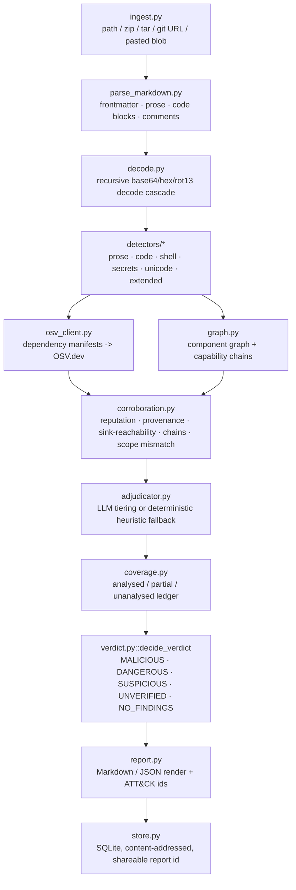
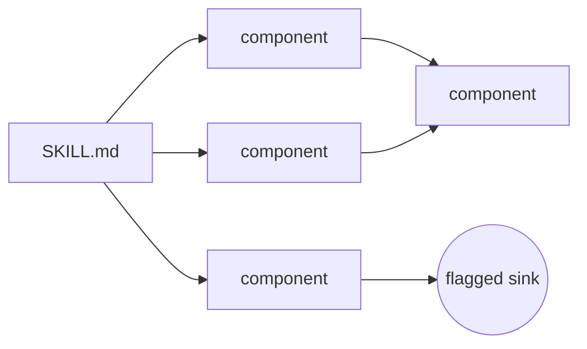

← [README](../README.md)

# Architecture

Two parts: the analysis model (`backend/skillcheck/`) that decides what a skill is doing, and the
frontend that presents its output. The analysis model is the core of the project — the frontend is a
thin, framework-free presentation layer over it.

## Analysis model

### Pipeline

`backend/skillcheck/pipeline.py::scan()` runs every scan, whether triggered from the API, the CLI, or a
test. Stages run in this order (`_scan_ingested()`):

A stage is run through `_scan_stage()`, which catches any exception the stage raises, records it, and
substitutes a safe default rather than failing the whole scan — a bug in one detector can't sink a
scan (this is invariant I1, see below).

### Ingest, parse, decode

- `ingest.py` accepts a filesystem path, a `.zip`/`.tar[.gz]` archive, a `git clone --depth 1`-able
  GitHub URL, or a pasted `(name, text)` blob, and normalizes all of them into the same `IngestResult`.
- `parse_markdown.py` splits each Markdown file into frontmatter, prose, fenced code blocks, and HTML
  comments, each independently handed to every detector, with line-number offsets mapped back to the
  original file so every finding can quote an exact span.
- `decode.py` recursively decodes base64/hex/rot13-style obfuscated payloads found anywhere in the text
  and re-runs detection on what comes out, so an obfuscated instruction doesn't slip past the detectors
  that only see the outer layer.

### Detectors

Registered in `backend/skillcheck/detectors/__init__.py::ALL_DETECTORS`, six detectors run over every
layer of every file: `prose` (natural-language intent), `code` (AST-based Python analysis), `shell`
(shell command pattern matching), `secrets`, `unicode` (bidi/zero-width character tricks), `extended`.
Each is independently catchable — a detector crash becomes an `SC-SCN1` integrity finding instead of an
unhandled exception.

### Capability taxonomy

Every finding is tagged with one `Capability` (`backend/skillcheck/models.py`):
`credential_access`, `exfiltration`, `hidden_execution`, `stage2_fetch`, `persistence`,
`anti_forensics`, `agent_manipulation`, `task_then_payload`, `scope_mismatch`, `obfuscation`, `ssrf`,
`privilege_escalation`, `harmful_content`, `anti_refusal`, `agent_snooping`, `unscanned_reference`,
`unknown`. Each maps to a real-world technique id in `report.py::ATTACK_TECHNIQUE` — e.g.
`credential_access` → `T1552 (Unsecured Credentials)`, `agent_manipulation` →
`AML.T0051 (LLM Prompt Injection) / OWASP LLM01`, `scope_mismatch` → `OWASP LLM08 (Excessive Agency)` —
so every finding traces to a named ATT&CK or OWASP-LLM technique, not just an internal label.

Findings also carry a `Severity` (`low`, `medium`, `high`, `critical`) independent of capability.

### Dependency and component graph

- `osv_client.py` extracts dependency manifests from scanned files and queries OSV.dev for known
  vulnerabilities in them.
- `graph.py::build_component_graph` builds a graph of files and the references between them (e.g. a
  SKILL.md pointing at a bundled script), and flags any reference to a file that wasn't actually part
  of the scan as `SC-REF1` (an unscanned reference) rather than silently ignoring it.
- `graph.py::build_capability_chains` links findings across that graph into `Chain`s — e.g. a
  credential-read finding in one file connected to an exfiltration sink in another — because a
  capability chain across files is stronger evidence than either finding alone.

### Corroboration

`corroboration.py` runs five independent checks that strengthen or weaken raw detector output before
adjudication: `corroborate_provenance`, `corroborate_reputation` (mentions of known-bad domains),
`corroborate_sink_reachability` (is a flagged sink actually reachable from an entry point in the
graph), `corroborate_chains` (do chain members corroborate each other), and
`corroborate_scope_mismatch` (does the file's declared `description:` frontmatter match what it
actually does).

### Adjudication

`adjudicator.py` assigns every finding a `Tier` — `confirmed`, `likely`, `possible`,
`insufficient_context` (escalates, never clears — invariant I4), `false_positive_suspected` — and never
deletes a finding regardless of tier (invariant I2). Tiering is done by an LLM when a key is available,
provider precedence `ANTHROPIC_API_KEY` → `OPENROUTER_API_KEY` → `GEMINI_API_KEY` (server-side), or a
caller-supplied bring-your-own-key overrides all three for that one request. With no key anywhere, a
deterministic heuristic tiering runs instead — the scan still completes.

### Coverage

`coverage.py::build_ledger` tracks, per file, whether it was `analysed`, `partial`, or `unanalysed`
(and why — binary, oversized, undecodable, remote-fetch-only, etc.), and rolls that up into a single
coverage percentage attached to the verdict.

### Verdict

`verdict.py::decide_verdict` combines findings, chains, the coverage ledger, and scope-mismatch state
into one of five labels, evaluated in this order — never `SAFE` (invariant I3; the clean state is
`NO_FINDINGS` with its coverage ledger attached):

1. **`MALICIOUS`** — any `CONFIRMED`-tier finding that's part of a chain, or any `CONFIRMED` +
   `CRITICAL`-severity finding.
2. **`DANGEROUS`** — a `LIKELY`-tier chain, or a `LIKELY`/`CONFIRMED` finding with capability
   `anti_forensics`, `persistence`, or `agent_manipulation`.
3. **`SUSPICIOUS`** — an uncorroborated `HIGH`/`CRITICAL`-severity finding at `POSSIBLE` tier or above,
   a declared-vs-actual scope mismatch, or two independent `MEDIUM`-severity findings that corroborate
   each other (a single uncorroborated `MEDIUM` finding can never convict alone).
4. **`UNVERIFIED`** — coverage falls below the configured threshold, the graph shows content only
   resolvable at runtime, a `HIGH`/`CRITICAL` finding was tiered `insufficient_context` (escalated, not
   cleared), or the document references local content that wasn't part of the scan.
5. **`NO_FINDINGS`** — none of the above; the clean state, always shown with its coverage ledger.

### Report and storage

`report.py` renders the verdict to Markdown or JSON and annotates every finding with its ATT&CK/OWASP
technique id. `store.py` persists reports in SQLite, keyed by `sha256(ruleset_version + content)`, so an
identical scan is served from cache and shareable via `/api/report/{report_id}` — the frontend surfaces
`cached`/`scanned_at` and a "Rescan for fresh data" action since repo and OSV data can go stale between
scans of the same content.

## Frontend

The frontend (`frontend/index.html` + `frontend/app.js`) is a single, framework-free page that calls the
API above and renders its output — no build step, no component library, no design-token file separate
from the CSS itself.

### Design principle

From the stylesheet's opening comment: *"premium technical dark mode. True-black background, flat
near-black surfaces (tonal steps, not translucent glass), thin 1px borders, one restrained accent,
functional (non-decorative) severity colors. Hierarchy comes from spacing/type/contrast, not blur or
glow. No gradients."*

### Theming

`:root` defines the light palette; `:root[data-theme="dark"]` and
`@media (prefers-color-scheme: dark) { :root:not([data-theme="light"]) { ... } }` both redefine the same
tokens for dark mode, so the app follows OS dark mode automatically, and an explicit `data-theme`
attribute — toggled from the header, persisted to `localStorage` — overrides it either way.
`color-scheme: light` / `dark` is set alongside each palette so native form controls match.

### Color tokens

| Token | Light | Dark |
|---|---|---|
| `--bg` | `#fafafa` | `#000000` |
| `--surface-1` | `#ffffff` | `#0a0a0a` |
| `--surface-2` | `#f1f1f3` | `#101010` |
| `--surface-hover` | `#ececee` | `#161616` |
| `--border` | `rgba(10,10,15,0.10)` | `rgba(255,255,255,0.08)` |
| `--border-strong` | `rgba(10,10,15,0.18)` | `rgba(255,255,255,0.16)` |
| `--text` | `#16161a` | `#f4f4f5` |
| `--text-dim` | `#68686f` | `#8b8b92` |
| `--accent` | `#2f5fd6` | `#5b8fff` |
| `--accent-contrast` | `#ffffff` | `#04070d` |
| `--accent-tint` | `rgba(47,95,214,0.09)` | `rgba(91,143,255,0.10)` |

Semantic severity/verdict colors (each paired with a `-bg` tint), which map directly to the same
`VerdictLabel`/`Severity` values the analysis model produces — `.v-MALICIOUS` etc. and `.sev-critical`
etc. in the CSS:

| Token | Light | Dark |
|---|---|---|
| `--safe` | `#17824f` | `#34d67f` |
| `--suspicious` | `#9a5b06` | `#ffb020` |
| `--dangerous` | `#c22a20` | `#ff5a52` |
| `--high` | `#b8480c` | `#ff8a4c` |
| `--inconclusive` | `#55546c` | `#9a9aa3` |

### Typography and radii

`--sans` (system stack incl. Inter) for prose; `--mono` (ui-monospace/SF Mono/Menlo/Consolas) for
labels, badges, code, and tabs — a deliberate split between prose and technical chrome.
Radii: `--radius-sm: 6px`, `--radius: 10px`, `--radius-lg: 14px`.

### Components and iconography

Class-based, no component library: `.card`, `.tabs`/`.tab`, `.chip`, `.badge` (+ tier variants),
`.verdict-badge` (+ `.v-MALICIOUS` etc.), `.finding-card` (+ `.sev-critical` etc.),
`.coverage-bar`/`.coverage-legend`, `.eyebrow`, `.how-strip`/`.how-step`. Icons are a hand-authored SVG
path set (`ICON_PATHS` in `app.js`: triangle, alertCircle, info, check, help) instantiated through a
`<template>` element — no icon library. The favicon and header brand mark are hand-written inline SVG.

The hero section of `index.html` includes a hand-authored inline SVG illustrating how a `SKILL.md`
decomposes into a component graph where most nodes stay clean and one path reaches a flagged sink —
the same shape as the component graph the analysis model actually builds in `graph.py`:

### Explicit non-goals

No CSS framework (no Tailwind, no Bootstrap), no component library, no bundler/build step, no
glassmorphism, no blur, no glow, no gradients — stated in the stylesheet's opening comment and
consistent with every rule in the file.
