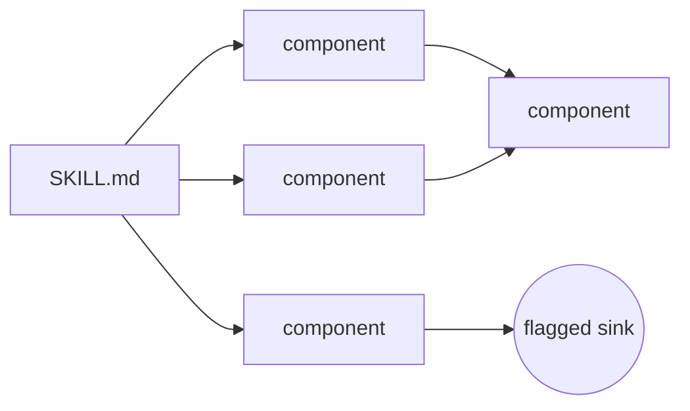

← [README](../README.md)

# Design system

Everything below is defined in `frontend/index.html`'s inline `<style>` block and used directly in
`frontend/app.js`/`frontend/index.html` markup — there is no separate CSS framework, component library,
design-token file, or build step. All of it renders through plain CSS custom properties and class-based
selectors.

## Design principle

From the code comment at the top of the stylesheet: *"premium technical dark mode. True-black
background, flat near-black surfaces (tonal steps, not translucent glass), thin 1px borders, one
restrained accent, functional (non-decorative) severity colors. Hierarchy comes from spacing/type/
contrast, not blur or glow. No gradients."*

## Theming mechanism

- `:root` defines the light palette; `:root[data-theme="dark"]` and
  `@media (prefers-color-scheme: dark) { :root:not([data-theme="light"]) { ... } }` both redefine the
  same tokens for dark mode — so the app respects OS dark mode automatically, and an explicit
  `data-theme` attribute (toggled via the header button, persisted to `localStorage`) overrides it in
  either direction.
- `color-scheme: light` / `color-scheme: dark` is set alongside each palette so native form controls
  match.

## Color tokens

| Token | Light | Dark |
|---|---|---|
| `--bg` | `#fafafa` | `#000000` |
| `--surface-1` | `#ffffff` | `#0a0a0a` |
| `--surface-2` | `#f1f1f3` | `#101010` |
| `--surface-hover` | `#ececee` | `#161616` |
| `--border` | `rgba(10,10,15,0.10)` | `rgba(255,255,255,0.08)` |
| `--border-strong` | `rgba(10,10,15,0.18)` | `rgba(255,255,255,0.16)` |
| `--text` | `#16161a` | `#f4f4f5` |
| `--text-dim` | `#68686f` | `#8b8b92` |
| `--accent` | `#2f5fd6` | `#5b8fff` |
| `--accent-contrast` | `#ffffff` | `#04070d` |
| `--accent-tint` | `rgba(47,95,214,0.09)` | `rgba(91,143,255,0.10)` |

Semantic severity/verdict colors (each paired with a `-bg` tint of the same name):

| Token | Light | Dark |
|---|---|---|
| `--safe` | `#17824f` | `#34d67f` |
| `--suspicious` | `#9a5b06` | `#ffb020` |
| `--dangerous` | `#c22a20` | `#ff5a52` |
| `--high` | `#b8480c` | `#ff8a4c` |
| `--inconclusive` | `#55546c` | `#9a9aa3` |

These are functional, not decorative — they map directly to verdict labels (`.v-MALICIOUS` etc.) and
finding severities (`.sev-critical` etc.) in the UI.

## Typography

- `--sans: -apple-system, BlinkMacSystemFont, "Segoe UI", Inter, sans-serif` — body prose.
- `--mono: ui-monospace, SFMono-Regular, "SF Mono", Menlo, Consolas, monospace` — labels, badges, code,
  tabs, and other technical chrome. The mono/sans split is deliberate: prose reads as prose, anything
  that's effectively UI metadata reads as technical/monospaced.

## Radii

`--radius-sm: 6px`, `--radius: 10px`, `--radius-lg: 14px`.

## Component inventory

Real, currently-used classes: `.card`, `.tabs` / `.tab`, `.chip`, `.badge` (with tier-specific
variants), `.verdict-badge` (with verdict-specific variants like `.v-MALICIOUS`), `.finding-card` (with
severity-specific variants like `.sev-critical`), `.coverage-bar` / `.coverage-legend`, `.eyebrow`,
`.how-strip` / `.how-step`.

## Iconography

No icon library. `app.js` defines a small hand-authored SVG path set (`ICON_PATHS`: triangle,
alertCircle, info, check, help) instantiated through a `<template>` element at render time. The
favicon and header brand mark are also hand-written inline SVG, not image files.

## Architecture diagram

The hero section of `index.html` includes a hand-authored inline SVG (not a screenshot, not a library
diagram) illustrating how a `SKILL.md` decomposes into a component graph where most nodes stay clean and
one path reaches a flagged sink. Redrawn here as Mermaid for docs portability:

## Explicit non-goals

No CSS framework (no Tailwind, no Bootstrap), no component library, no bundler/build step, no
glassmorphism, no blur, no glow, no gradients — stated directly in the stylesheet's opening comment and
consistent with every rule in the file.
