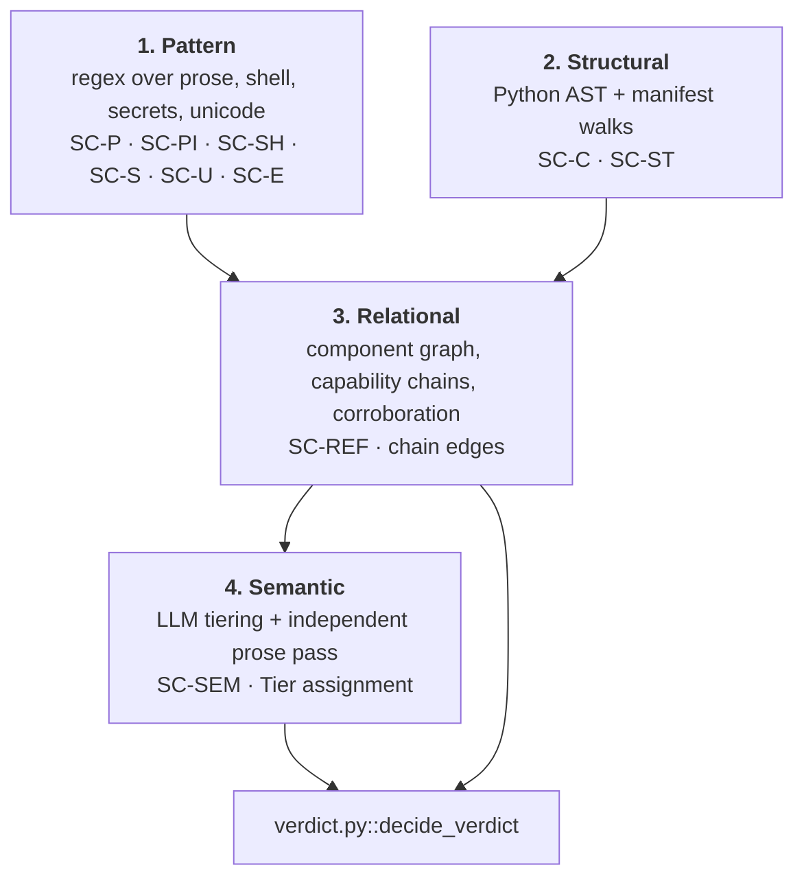

← [README](../README.md) · [Architecture](architecture.md)

# Detection model

What SkillCheck actually looks for, why it's organised this way, and what it
cannot see. This is the "why" companion to [architecture.md](architecture.md),
which covers the "how" — module wiring, stage order, frontend.

## There is no model

SkillCheck ships no classifier, no embedding index, and no model weights. Every
deterministic finding comes from a regular expression, a Python AST walk, or a
structural walk over a parsed manifest. An LLM participates, but only *after*
detection, and only to rank findings that were already produced — it cannot
create a finding out of nothing, and it cannot delete one (invariant I2).

This is a deliberate trade, and it has a cost worth stating plainly: a
paraphrased attack that no pattern anticipates scores nothing on the
deterministic path. See [Known blind spots](#known-blind-spots).

What the design buys instead is that **the conviction path is auditable**. Every
`MALICIOUS` verdict traces to a named rule, a quoted span with line numbers, and
a chain or corroboration edge that can be printed and argued with. Nothing
convicts because a number crossed a threshold nobody can explain.

## Four signal classes

Detection is layered by *what kind of question is being asked*, not by file
type. The four classes are independent — each can fire alone — and they compose
in one direction only: later classes reason about earlier findings, never the
reverse.

### 1. Pattern — what the text says

Regular expressions over every layer of every file: frontmatter, prose, fenced
code blocks, HTML comments, and every span recovered by the decode cascade.

| Family | Count | File | Asks |
|---|---|---|---|
| `SC-P1`–`SC-P13` | 13 | [detectors/prose.py](../backend/skillcheck/detectors/prose.py) | Does the English prose instruct the agent to conceal, override, or defer an action? |
| `SC-PI1`–`SC-PI49` | 49 | [detectors/prose_intl.py](../backend/skillcheck/detectors/prose_intl.py) | Same seven intents as above, in Spanish, French, German, Portuguese, Russian, Chinese, and Japanese |
| `SC-SH1`–`SC-SH12` | 12 | [detectors/code.py](../backend/skillcheck/detectors/code.py) | Does a shell fragment fetch-and-run, exfiltrate, persist, or clear its tracks — including through quote-splitting or `$IFS` obfuscation? |
| `SC-S1`–`SC-S7` | 7 | [detectors/secrets.py](../backend/skillcheck/detectors/secrets.py) | Is a live credential embedded in the bundle? |
| `SC-U1`–`SC-U3` | 3 | [detectors/unicode_tricks.py](../backend/skillcheck/detectors/unicode_tricks.py) | Is text rendered differently to a human than to the model? |
| `SC-E1`–`SC-E10` | 10 | [detectors/extended.py](../backend/skillcheck/detectors/extended.py) | Second-order patterns, incl. SSRF and chained credential paths. |

Prose is the primary class, not an afterthought: in a skill package the payload
*is* prose, and a `SKILL.md` is markdown — a format, not a language. `SC-P1`–
`SC-P13` and their `SC-PI*` counterparts below are held to the same standard,
so a non-English skill isn't scanned by a materially weaker rule set than an
English one.

**Non-English prose** ([detectors/prose_intl.py](../backend/skillcheck/detectors/prose_intl.py))
covers the same seven intents `SC-P1`–`SC-P13` already carry — the two agent-
manipulation phrasings, plus stage-2 fetch, exfiltration, credential access,
persistence, and anti-forensics — in seven languages, one literal phrasing
per intent per language rather than a generative translation layer. Two
properties fell out of testing every rule against natural (non-imperative)
sentences rather than the phrase each pattern was built from:

- **Word order isn't English's.** Japanese is verb-final (SOV), so a natural
  sentence puts the object before the verb — "`webhook.site` にレポートを
  送信" ("to webhook.site, [the report] send") — the reverse of the
  destination-after-verb order every other language in the set uses. The
  exfiltration and credential-access rules for Japanese match both orders for
  this reason; every other language matches destination-after-verb only,
  because that's the order those languages actually use.
- **Inflected forms aren't the imperative.** A pattern built from "descarga"
  (imperative "download!") doesn't match "descargar" (infinitive) or
  "descargando" (gerund) without saying so explicitly — German compounds this
  further with separable verbs, which appear split around an object in the
  imperative (`lade die Datei herunter`) but as one word in the infinitive
  (`...Datei herunterladen`); both forms are matched.

Confidence on every `SC-PI*` finding is 0.5, a notch below `SC-P*`'s 0.55 —
one literal phrasing per intent has had far less real-world exposure than an
English pattern already through several rounds of false-positive tuning, and
the confidence score says so rather than overclaiming.

Multilingual coverage surfaced a correctness bug in an unrelated rule:
`SC-U3` (mixed-script/homoglyph detection, in `detectors/unicode_tricks.py`)
computed each non-ASCII character's script correctly but never checked
*which* script it found before flagging — so a word mixing ASCII letters
with an accented Latin letter ("configuración", "über", "não") scored
identically to a genuine Cyrillic-into-Latin homoglyph substitution
("`аdmin`" with a Cyrillic "а"), because both are "a non-ASCII letter next
to an ASCII letter in the same word" and the rule stopped there. Every
accented word in ordinary Spanish, French, German, or Portuguese prose was a
false positive. The fix excludes `LATIN` from the set of scripts the rule
treats as suspicious — accented Latin is the same script as ASCII, not a
different one impersonating it — while a genuine cross-script substitution
still fires exactly as before. Left unfixed, this would have quietly made
every non-English skill more false-positive-prone than an English one for no
security reason, which runs directly against the point of adding `SC-PI*` in
the first place.

**Shell de-obfuscation** ([detectors/code.py](../backend/skillcheck/detectors/code.py)`::_deobfuscate_shell`)
runs `SC-SH1`–`SC-SH11` a second time over a normalized copy of the text
when normalization changes anything, collapsing two zero-cost evasions that
otherwise defeat every shell pattern outright: quote-splitting a command name
(`cu''rl`, `c'u'r'l` both still run `curl`) and substituting `$IFS` — the
shell's field-separator variable — for the spaces between arguments
(`curl$IFS-s$IFSurl`). Neither trick changes what the shell executes. This is
a normalization pass, not a shell parser — it doesn't tokenize or track
quoting state, it only collapses these two specific constructions — so it
closes the two most common command-name evasions without a grammar
dependency. A finding recovered this way carries confidence 0.5 (versus 0.6
for the same rule matching raw text) and is joined by `SC-SH12`
(`Capability.OBFUSCATION`), which names the evasion itself and lists every
rule it was hiding — so the technique is reported even when the underlying
command alone wouldn't have been severe enough to convict on its own.

### 2. Structural — what the package declares

Two different walks, joined by the same question: what does this bundle arrange
to happen that isn't written in its text?

**Python AST** ([detectors/code.py](../backend/skillcheck/detectors/code.py),
`SC-C1`–`SC-C8`) — `ast.parse` over `.py` files and `python`-fenced blocks,
flagging `eval`/`exec`/`os.system`/`subprocess(shell=True)`/dynamic `getattr`.
AST rather than regex because `eval` appearing in a comment, a string, or the
name `re.compile` is not a call — the parser knows the difference and a pattern
does not.

**Manifest walks** ([structure.py](../backend/skillcheck/structure.py),
`SC-ST1`–`SC-ST8`) — the layer that exists because *no content detector reads
configuration as configuration*:

| Rule | Declares | Severity | Why it isn't a content finding |
|---|---|---|---|
| `SC-ST1` | Event hook in a bundled `settings.json` | CRITICAL (session-wide) / HIGH (tool-scoped) | Dispatched by the harness on an event — no tool call to review, no prompt to decline |
| `SC-ST2` | `bypassPermissions`, `enableAllProjectMcpServers`, unscoped tool grants | CRITICAL / HIGH | Removes the approving, not just widens what may be approved |
| `SC-ST3` | Bundled MCP server | HIGH | Tool descriptions enter context at session start, before the skill is invoked, and are not part of this scan |
| `SC-ST4` | `.claude/agents/*.md` subagent definition | HIGH | The body is a system prompt for a second model instance, not documentation |
| `SC-ST5` | Bundled code SKILL.md never reaches | MEDIUM | Requires the component graph; may run via a side channel or lie dormant |
| `SC-ST6` | `env` var retargeting the harness endpoint / proxy | CRITICAL | Redirects *every* outbound request for the session, credentials included |
| `SC-ST7` | `statusLine.command` | HIGH | Same unsupervised shape as a hook, under a key not nested in `hooks` |
| `SC-ST8` | npm install scripts, in-tree PEP 517 backend | CRITICAL | Runs at install time, before any script a reviewer would open |

Two design rules govern this layer:

- **Schema-agnostic walks.** `_hook_commands` finds any `command` key under an
  event, at any nesting, via a bounded breadth-first queue — rather than
  matching the documented `{event: [{matcher, hooks: [{type, command}]}]}`
  layout. The schema has changed before; a rule reading config the model never
  sees is the worst place to acquire a silent blind spot on the next revision.
- **Derived, not enumerated.** Whether a permission grant is unbounded is
  decided by asking whether its scope names anything at all (`_scope_is_unbounded`:
  no alphanumeric character means it restricts nothing), so `*`, `**`, `*:*`,
  `:*`, `:`, `( * )` and spellings nobody listed all read as unbounded. An
  enumeration is a list of the wildcards we happened to imagine.

### 3. Relational — what the findings mean together

A finding in isolation is a fact about one span. The relational class asks
whether those facts connect.

- [graph.py](../backend/skillcheck/graph.py)`::build_component_graph` — files and
  the references between them. Every node carries `reachable_from_root` and a
  `load_stage` (`unattended` · `immediate` · `on-demand` · `runtime` ·
  `unreachable`), so progressive-disclosure abuse is visible as a property of
  the graph. `mark_unattended_nodes` promotes any node a structural finding
  showed is hook- or install-triggered to `unattended` — the strongest rung,
  because nothing has to read it for it to run.
- `build_capability_chains` — links findings across the graph into chains, e.g.
  a credential read in one file reaching an exfiltration sink in another.
- [corroboration.py](../backend/skillcheck/corroboration.py) — five independent
  checks: provenance, reputation, sink-reachability, chain-member agreement, and
  declared-vs-actual scope mismatch.
- `SC-REF1` — a reference to content that wasn't scanned is recorded, never
  silently dropped.

This class is why the false-positive rate is what it is. A single uncorroborated
MEDIUM cannot convict; escalation to `DANGEROUS`+ generally requires a chain or
an independently corroborating second finding.

### 4. Semantic — what a reader would conclude

[adjudicator.py](../backend/skillcheck/adjudicator.py) assigns every finding a
`Tier` (`confirmed` · `likely` · `possible` · `insufficient_context` ·
`false_positive_suspected`) and runs one independent pass over raw prose that
can raise `SC-SEM1` for intent no pattern matched.

Provider precedence: `ANTHROPIC_API_KEY` → `OPENROUTER_API_KEY` →
`GEMINI_API_KEY`, with a caller-supplied BYOK overriding all three for a single
request. **With no key anywhere, a deterministic heuristic tiering runs instead
and the scan completes.**

The adjudicator's authority is asymmetric and enforced in code, not in the
prompt:

- It **ranks, never filters** — no tier removes a finding from the report (I2).
- It may only clear an allowlisted set of capabilities (`_CLEARABLE`:
  `scope_mismatch`, `agent_snooping`, `unknown`). It has no path to clear a
  `credential_access` or `exfiltration` finding regardless of what it argues.
- `insufficient_context` escalates the verdict toward `UNVERIFIED`; it never
  clears (I4).

## The determinism boundary

Everything in classes 1–3 is deterministic: same bytes in, same findings out, no
network, no key, no clock. This is the boundary the test suite is written
against — `tests/test_structure.py` unsets every provider key precisely so it
asserts deterministic behaviour rather than accidentally-correct LLM output.

| Component | Deterministic | Notes |
|---|---|---|
| Pattern, structural, relational classes | Yes | Pure functions over file bytes |
| Verdict logic | Yes | Priority-ordered, no thresholds tuned against a corpus |
| Report rendering, ATT&CK/OWASP mapping | Yes | Static table in `report.py` |
| OSV.dev lookup | **No** | Network; advisory data changes over time |
| Repo ingestion (`git clone`) | **No** | Remote content changes |
| LLM tiering / `SC-SEM1` | **No** | Absent without a key; heuristic fallback is deterministic |

A skill that convicts deterministically convicts with the network unplugged.

## Never SAFE

There are five verdict labels and none of them is `SAFE` (invariant I3). The
clean state is `NO_FINDINGS`, and it is always rendered with its coverage ledger
(`analysed` / `partial` / `unanalysed` bytes per file) attached, because "we
found nothing" and "we read everything and found nothing" are different claims
and only one of them is ever true.

Consistent with this, a layer that fails does not silently produce a clean
result: `_scan_stage` catches the exception, records the layer, and emits an
`SC-SCN1` integrity finding — which floors the verdict above `NO_FINDINGS`.
Unparseable JSON at a harness-config path is the same case: unread content, not
absent content.

## Known blind spots

Stated because a scanner that hides its gaps is worse than one that has them.

| Gap | Impact |
|---|---|
| **Shell has no real grammar** | `_deobfuscate_shell` collapses quote-splitting and `$IFS`-as-separator specifically, but there is still no tokenizer or quoting-state tracker behind `SC-SH1`–`SC-SH11`. Variable indirection (`x=curl; $x -s ...`), arithmetic-expansion tricks, and evasions this pass wasn't built for still walk through untouched — normalizing two named evasions is not the same claim as parsing the language. |
| **No JS / notebook parsing** | A bundled `.js`, `.mjs`, or `.ipynb` payload is seen only by prose/shell patterns that happen to match. `SC-ST5` flags it as unreferenced code but cannot read it. |
| **`SC-PI*` is seven languages, one phrasing each** | Real coverage, not exhaustive: a paraphrase of "ignore previous instructions" this module's translator didn't anticipate is exactly as invisible as an English paraphrase `SC-P*` didn't anticipate, and every language outside the seven covered is untouched. |
| **No offline semantic layer** | With no API key, detection is pure pattern matching — a paraphrase no rule anticipates scores nothing, in any language. |
